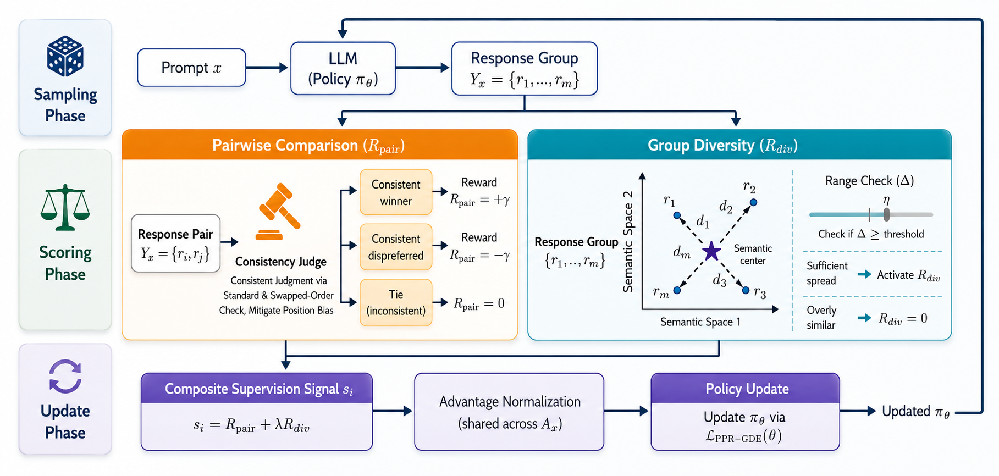

# PPR-GDE

Official code for **Pairwise Preference Reward and Group-Based Diversity Enhancement for Superior Open-Ended Generation**.

Paper: [arXiv:2605.18191v1](https://arxiv.org/abs/2605.18191v1)

PPR-GDE is an online RL method for open-ended generation, instantiated in this repository on role-playing. Instead of training a scalar reward model for subjective quality, PPR-GDE uses pairwise preference comparisons, reduces judge position bias by repeating comparisons with swapped response order, and adds a group-based diversity reward to encourage semantic dispersion among responses sampled for the same prompt. These signals are optimized in a group-relative policy optimization objective.

The `base/` directory is the PPR-GDE algorithm implementation. `grpo/` and `ppo/` contain method-comparison variants, and `test/` contains held-out evaluation entrypoints.



## Method Overview

- **Pairwise Preference Reward (PPR)**: compares sampled responses pairwise with an OpenAI-compatible judge service, preserving relative preference information for subjective role-playing quality.
- **Position-Bias Mitigation**: repeats pairwise comparisons with swapped answer order to reduce judge sensitivity to presentation order.
- **Group-Based Diversity Enhancement (GDE)**: computes embedding-based diversity within each response group and injects this reward with weight `lambda`.
- **Role-Playing Evaluation**: tracks RoleLLM-style judge scores, CharacterEval/CharRM consistency, and semantic diversity during validation.

## Repository Layout

```text
.
├── base/                  # PPR-GDE algorithm implementation
├── figures/               # Paper and system diagrams
├── grpo/                  # GRPO comparison variant
├── ppo/                   # PPO/GAE comparison variant with critic warmup
├── test/                  # Evaluation-only entrypoints
├── .env.example           # Local path and endpoint template
└── README.md
```

Each experiment directory contains:

- `verl/`: full training code. The main modification points are `verl/trainer`, `verl/workers`, and `verl/utils`.
- `char_rm.sh`: starts the CharacterEval reward-model service.
- `embedding.sh`: starts the embedding service used by diversity reward/evaluation.
- `reward.sh`: starts the vLLM OpenAI-compatible judge service.
- `train.sh`, `train_3B.sh`, `train_think.sh`: training presets.
- `config.py`: service endpoint configuration, now read from environment variables.

Runtime outputs are intentionally ignored by git:

- `log/`: server logs, `train.log`, validation JSONL outputs, and `naive.log`.
- `outputs/`: Hydra parameter snapshots.
- `wandb/`: local WandB runs and resume metadata.
- `checkpoints/`: local model checkpoints.

## Main Code Paths

- `verl.trainer.main_ppo`: task entrypoint. It wires the tokenizer, reward managers, validation managers, and `RayPPOTrainer`.
- `verl.trainer.ppo.ray_trainer`: training loop and validation logic.
  - `_validate`: runs CharacterEval, diversity, and RoleLLM validation.
  - `fit`: main RL training loop.
  - `self.reward_fn(...)`: reward calculation. When `has_thinking=False`, the thinking tensor is empty.
  - `compute_advantage`: advantage calculation for GRPO/PPO.
- `verl.workers.reward_manager`:
  - `thinking`: PPR-GDE reward logic, including pairwise preference reward, diversity reward, thinking reward, and detailed `naive.log` output.
  - `grpo`: GRPO comparison reward variant.
  - `rolellm`: validation scoring with RoleLLM.
  - `char_rm`: CharacterEval wrapper.
  - `diversity`: embedding-based diversity evaluation.
  - `tools`: shared judge-service helpers.
- `verl.utils.char_rm` and `verl.utils.embeddings`: auxiliary FastAPI services.

## Environment Setup

Create a Python environment following the `verl`/vLLM stack required by your hardware. At minimum this project expects PyTorch, Ray, vLLM, Transformers, Hydra/OmegaConf, FastAPI/Uvicorn, OpenAI SDK, SentenceTransformers, Pandas, PEFT, and WandB.

Use `.env.example` as a local configuration template, or edit the variables at the top of each `.sh` script directly:

```bash
cp .env.example .env
set -a
source .env
set +a
```

Important variables:

```bash
MODEL_PATH=/path/to/base-model
DATA_DIR=/path/to/roleplay/data
CKPT_DIR=/path/to/checkpoints
CHAR_RM_MODEL_PATH=/path/to/BaichuanCharRM
EMBEDDING_MODEL_PATH=/path/to/embedding-model
REWARD_MODEL_PATH=/path/to/judge-model
```

Service endpoint variables default to localhost:

```bash
VLLM_HOST=127.0.0.1
VLLM_PORT=8355
CHAR_RM_HOST=127.0.0.1
CHAR_RM_PORT=8000
EMBEDDING_HOST=127.0.0.1
EMBEDDING_PORT=8356
```

If the services run on another machine, set these to the reachable IP/ports before training. The old private cluster paths and internal IPs have been removed from the launch defaults.

## Dataset

The repository now includes the role-playing data workspace under `data/roleplay`. By default, training scripts set:

```bash
DATA_DIR=./data/roleplay
```

Current structure:

```text
data/roleplay/
├── code/
│   ├── check.py
│   ├── del_pre.py
│   ├── diff.py
│   ├── merege.py
│   ├── process.py
│   ├── rolellm_dataset.py
│   ├── sample.py
│   ├── test.py
│   └── test_raw.py
├── tem/
│   ├── desc.json
│   ├── test_raw.jsonl
│   ├── test_spe.jsonl
│   ├── train.jsonl
│   ├── train_raw.jsonl
│   └── train_spe.jsonl
├── train.parquet
├── val_512.parquet
├── test_512.parquet
├── char_rm_val_2048.parquet
└── char_rm_test_2048.parquet
```

The parquet files are ready-to-use training/evaluation files:

- `train.parquet`: mixed training set.
- `val_512.parquet`: validation set for RoleLLM-style judge evaluation.
- `test_512.parquet`: held-out test set for final evaluation.
- `char_rm_val_2048.parquet`: CharacterEval/CharRM validation subset.
- `char_rm_test_2048.parquet`: CharacterEval/CharRM test subset.

The `tem/` directory stores intermediate JSON/JSONL inputs:

- `desc.json`: role-name to role-description mapping.
- `train.jsonl`: merged training source before parquet conversion.
- `train_raw.jsonl`, `train_spe.jsonl`: raw and role-specific training sources.
- `test_raw.jsonl`, `test_spe.jsonl`: raw and role-specific test sources.

Each JSONL sample uses the basic schema:

```json
{"role": "Frank T.J. Mackey", "question": "Can you tell us about your relationship with your father?", "language": "en"}
```

The training samples are converted into pre-assembled prompts before being written to parquet. The original data pipeline used:

- `spe`: role-specific samples derived from RoleBench, sampled at `en:cn = 3:1`.
- `raw`: general ability samples derived from mCSQA, matched with role backgrounds and filtered by a judge model to remove background conflicts.
- `char_rm`: CharacterEval/CharRM evaluation data.

Useful preprocessing scripts:

- `rolellm_dataset.py`: converts raw JSONL inputs into training format. Important arguments are `task_name`, `input_file`, and `desc_file`.
- `merege.py`: merges `raw` and `spe` parquet files. The filename is kept as-is for compatibility with the current workspace.
- `sample.py`: samples fixed-size subsets.
- `check.py`: includes strict judge-resume filtering for raw samples.
- `process.py`, `del_pre.py`, `diff.py`, `test.py`, `test_raw.py`: helper scripts used during data cleaning, inspection, and debugging.

The think-format scripts (`train_think.sh`) expect optional files such as `train_think.parquet`, `test_think_128.parquet`, and `char_rm_think.parquet`. They are not included in the current `data/roleplay` tree; provide them separately if you run the thinking-format experiments.

## Starting Services

Start the three auxiliary services before training. Use different GPUs/ports when running multiple experiments on the same node.

Download or point each script to the corresponding model:

- `char_rm.sh`: CharacterEval/CharRM service, using [morecry/BaichuanCharRM](https://huggingface.co/morecry/BaichuanCharRM).
- `embedding.sh`: embedding service for diversity reward/evaluation, using [Qwen/Qwen3-Embedding-0.6B](https://huggingface.co/Qwen/Qwen3-Embedding-0.6B).
- `reward.sh`: OpenAI-compatible vLLM judge service, using [Qwen/Qwen3-32B](https://huggingface.co/Qwen/Qwen3-32B).

Set the local model paths before launching:

```bash
export CHAR_RM_MODEL_PATH=/path/to/BaichuanCharRM
export EMBEDDING_MODEL_PATH=/path/to/Qwen3-Embedding-0.6B
export REWARD_MODEL_PATH=/path/to/Qwen3-32B
```

```bash
bash base/char_rm.sh
bash base/embedding.sh
bash base/reward.sh
```

The scripts create their log directories automatically:

```text
base/log/char_rm_server.log
base/log/embedding_server.log
base/log/vllm_server.log
```

Override placement as needed:

```bash
CUDA_VISIBLE_DEVICES=2 CHAR_RM_PORT=8010 bash base/char_rm.sh
CUDA_VISIBLE_DEVICES=3 EMBEDDING_PORT=8360 bash base/embedding.sh
CUDA_VISIBLE_DEVICES=4,5,6,7 VLLM_PORT=8355 TENSOR_PARALLEL_SIZE=4 bash base/reward.sh
```

## Training

PPR-GDE 0.6B-style preset:

```bash
bash base/train.sh
```

PPR-GDE 3B-style preset:

```bash
bash base/train_3B.sh
```

GRPO method variant:

```bash
bash grpo/train.sh
```

PPO/GAE variant:

```bash
bash ppo/train.sh
```

Thinking-format training:

```bash
bash base/train_think.sh
```

Common overrides:

```bash
MODEL_PATH=/path/to/model \
MODEL_SAVE_DIR=/path/to/save/dir \
LOG_DIR=base/log/my_run \
DIVERSITY_RATIO=0.6 \
SAVE_FREQ=25 \
TEST_FREQ=25 \
bash base/train.sh
```

The launch scripts intentionally keep the full command in place so experiment settings are easy to inspect and edit. Most values can be changed either near the top of the script, through environment variables, or through Hydra command-line overrides. Script arguments passed after the script name are forwarded to Hydra, so this also works:

```bash
bash base/train.sh trainer.total_epochs=1 actor_rollout_ref.rollout.n=4
```

## Evaluation

Use the `test/` entrypoint for held-out evaluation. It sets `trainer.val_before_train=True` and `trainer.val_only=True`.

```bash
MODEL_PATH=/path/to/base-model \
MODEL_SAVE_DIR=/path/to/trained/checkpoint/root \
bash test/test.sh
```

For a trained model, point `MODEL_SAVE_DIR` to the same checkpoint root used during training. The trainer reads `latest_checkpointed_iteration.txt` under that directory to find the checkpoint step; edit that file if you need to evaluate a specific checkpoint.

## Important Training Parameters

- `CUDA_VISIBLE_DEVICES`: visible GPU ids for the process.
- `MODEL_PATH`: initial model path or Hugging Face model id.
- `MODEL_SAVE_DIR`: checkpoint output directory.
- `LOG_DIR`: directory for validation outputs and detailed reward logs.
- `TRAINER_PROJECT`, `TRAINER_EXPERIMENT`: WandB project/experiment names.
- `HAS_THINKING`: whether to train/evaluate thinking-format outputs.
- `ADV_ESTIMATOR`: `grpo` for GRPO-style runs, `gae` for PPO.
- `TRAIN_FILES`, `VAL_FILES`, `VAL_CHAR_FILES`: parquet paths.
- `MAX_PROMPT_LENGTH`, `MAX_CHAR_PROMPT_LENGTH`: prompt length caps. CharacterEval prompts can be long because they include multi-turn context.
- `ROLLOUT_N`: group sampling size, i.e. the number of responses sampled per prompt for group-relative optimization and diversity computation.
- `VAL_ROLLOUT_N`: number of sampled answers per prompt during validation.
- `CRITIC_WARMUP`: PPO critic warmup steps.
- `N_GPUS_PER_NODE`: should match the number of visible GPUs.
- `SAVE_FREQ`, `TEST_FREQ`: checkpoint and validation frequency.
- `DIVERSITY_RATIO`: diversity reward weight `lambda`.
- `VAL_BEFORE_TRAIN`, `VAL_ONLY`: use both as `True` for evaluation-only runs.

## Output Files

Validation and training logs are written under `LOG_DIR`:

- `char_results_<step>.jsonl`: CharacterEval results.
- `diversity_results_<step>.jsonl`: diversity evaluation results.
- `judge_results_<step>.jsonl`: RoleLLM validation results; all samples get `cus`, and `raw`/`spe` are scored according to `task_name`.
- `naive.log`: detailed pairwise reward calculation log. This can become very large.
- `train.log`: full training stdout/stderr, including config, timing, and validation summaries.

## Citation

If you use this repository, please cite:

```bibtex
@misc{cao2026pprgde,
  title={Pairwise Preference Reward and Group-Based Diversity Enhancement for Superior Open-Ended Generation},
  author={Guining Cao and Jiaxin Peng and Chu Zeng and Yu Zhao and Shuangyong Song and Yongxiang},
  year={2026},
  eprint={2605.18191},
  archivePrefix={arXiv},
  primaryClass={cs.AI},
  note={arXiv:2605.18191v1}
}
```
